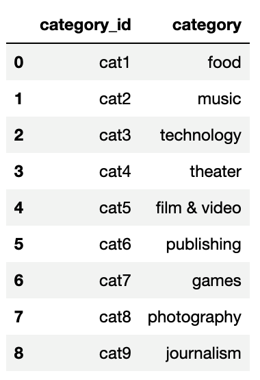
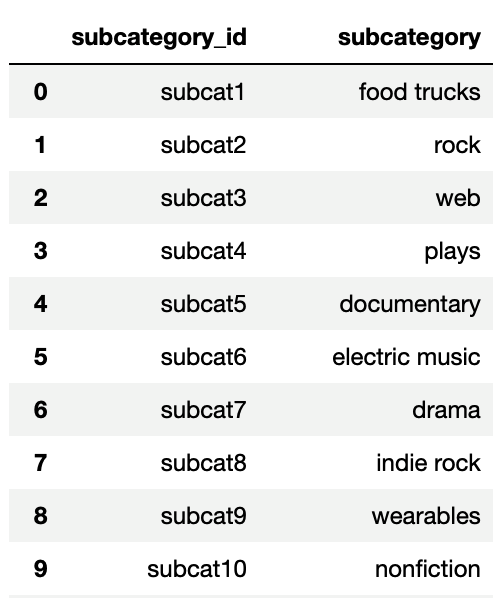
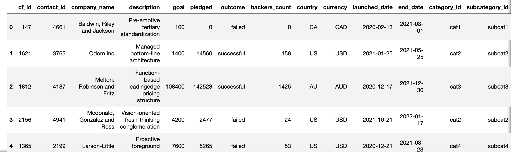
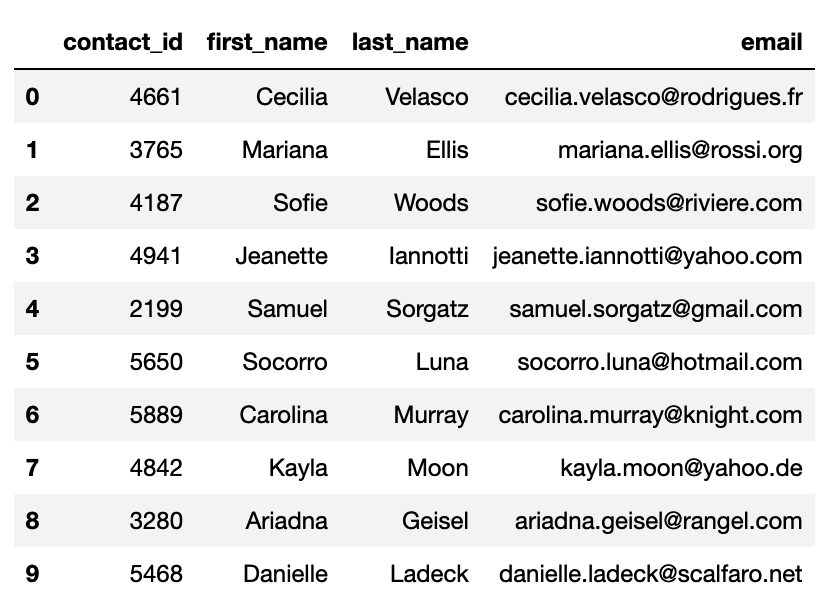
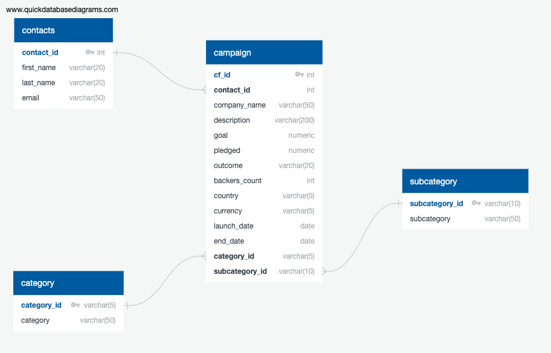

# crowdfunding_etl
ETL project for UC Berkeley data science bootcamp.

## Procedure
This ETL project is divided into the following subsections:

- Create the Category and Subcategory DataFrames
- Create the Campaign DataFrame
- Create the Contacts DataFrame
- Create the Crowdfunding Database

### Create the Category and Subcategory DataFrames
1. Extract and transform the `crowdfunding.xlsx` Excel data to create a category DataFrame that has the following columns:

    - A `category_id` column that has entries going sequentially from `cat1` to `cat_n_`, where n is the number of unique categories

    - A "category" column that contains only the category titles
    - The following image shows the category DataFrame:

    

2. Export the category DataFrame as `category.csv` and save it to your GitHub repository.

3. Extract and transform the `crowdfunding.xlsx` Excel data to create a subcategory DataFrame that has the following columns:

    - A "subcategory_id" column that has entries going sequentially from "subcat1" to "subcatn", where n is the number of unique subcategories

    - A "subcategory" column that contains only the subcategory titles

    - The following image shows this subcategory DataFrame:

    

4. Export the subcategory DataFrame as `subcategory.csv`.

### Create the Campaign DataFrame
Extract and transform the `crowdfunding.xlsx` Excel data to create a campaign DataFrame has the following columns:

- The "cf_id" column
- The "contact_id" column
- The "company_name" column
- The "blurb" column, renamed to "description"
- The "goal" column, converted to the `float` data type
- The "pledged" column, converted to the `float` data type
- The "backers_count" column
- The "country" column
- The "currency" column
- The "launched_at" column, renamed to "launch_date" and with the UTC times converted to the `datetime` format
- The "deadline" column, renamed to "end_date" and with the UTC times converted to the `datetime` format
- The "category_id" column, with unique identification numbers matching those in the "category_id" column of the category DataFrame
- The "subcategory_id" column, with the unique identification numbers matching those in the "subcategory_id" column of the subcategory DataFrame
- The following image shows the campaign DataFrame:

    

2. Export the campaign DataFrame as `campaign.csv`.

### Create the Contacts DataFrame
1. The following are two methods for extracting and transforming the data from the `contacts.xlsx` Excel data:

    - **Method 1:** Use Python dictionary methods.
    - **Method 2:** Use regular expressions.

#### Method 1
- Import the `contacts.xlsx` file into a DataFrame.
- Iterate through the DataFrame, converting each row to a dictionary.
- Iterate through each dictionary, doing the following:
    - Extract the dictionary values from the keys by using a Python list comprehension.
    - Add the values for each row to a new list.
- Create a new DataFrame that contains the extracted data.
- Split each "name" column value into a first and last name, and place each in a new column.
- Clean and export the DataFrame as `contacts.csv` and save it to your GitHub repository.

#### Method 2
- Import the `contacts.xlsx` file into a DataFrame.
- Extract the "contact_id", "name", and "email" columns by using regular expressions.
- Create a new DataFrame with the extracted data.
- Convert the "contact_id" column to the integer type.
- Split each "name" column value into a first and a last name, and place each in a new column.
- Clean and then export the DataFrame as contacts.csv and save it to your GitHub repository.

The following is an image of the final DataFrame:

### Create the Crowdfunding Database
1. Inspect the four `.csv` files, and then sketch an ERD of the tables.

2. Use the information from the ERD to create a table schema for each `.csv` file.
    - A PDF containing the table schema is included in the file named `crowdfunding_db_schema.pdf`.
    
3. Save the database schema as a Postgres file named `crowdfunding_db_schema.sql`.

4. Create a new Postgres database, named `crowdfunding_db`.
    - The create script is included in a file named `create_crowdfunding_db.sql`.

5. Using the database schema, create the tables in the correct order to handle the foreign keys.

6. Verify the table creation by running a `SELECT` statement for each table.
    - Verification queries are included in the file named `full-table_verification_queries.sql`.

7. Import each `.csv` file into its corresponding SQL table.

8. Verify that each table has the correct data by running a `SELECT` statement for each.
    - Verification queries are included in the file named `full-table_verification_queries.sql`.
